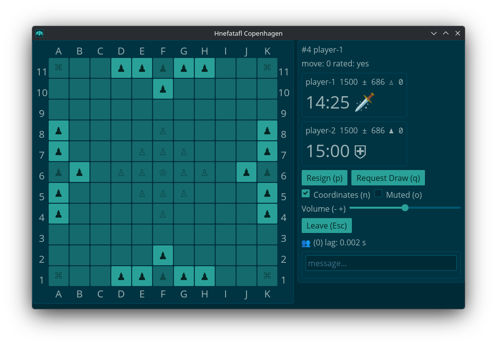

# Copenhagen Hnefatafl

[![github]][github-link]&ensp;[![crates-io]][crates-io-link]&ensp;[![docs-rs]][docs-rs-link]

[github]: https://img.shields.io/badge/github-8da0cb?logo=github
[github-link]: https://github.com/dcampbell24/hnefatafl
[crates-io]: https://img.shields.io/badge/crates.io-fc8d62?logo=rust
[crates-io-link]: https://crates.io/crates/hnefatafl-copenhagen
[docs-rs]: https://img.shields.io/badge/docs.rs-66c2a5?logo=docs.rs
[docs-rs-link]: https://docs.rs/hnefatafl-copenhagen



An [engine] similar to the [Go Text Protocol], a [client], and a [server]. For
help on how to use the engine see the module [documentation].

[engine]: https://github.com/dcampbell24/hnefatafl/blob/main/src/bin/hnefatafl-text-protocol.rs
[Go Text Protocol]: https://www.lysator.liu.se/~gunnar/gtp/gtp2-spec-draft2/gtp2-spec.html
[client]: https://github.com/dcampbell24/hnefatafl/blob/main/examples/hnefatafl-client.rs
[server]: https://github.com/dcampbell24/hnefatafl/blob/main/src/bin/hnefatafl-server-full.rs
[documentation]: https://docs.rs/hnefatafl-copenhagen/latest/hnefatafl_copenhagen/message/enum.Message.html

## Building and Running

First you need to install [Rust]. Then:

```sh
git clone https://github.com/dcampbell24/hnefatafl.git
cd hnefatafl
```

Then you can run the engine with:

```sh
cargo run --release --bin hnefatafl-text-protocol -- --display-game
```

or you can start a local server:

```sh
cargo run --release
```

and run a client:

```sh
RUST_LOG=hnefatafl_client=debug cargo run --release --example hnefatafl-client -- --host localhost
```

If you are running on Linux, you'll need some dependencies as [described] on the
website.

[Rust]: https://rust-lang.org/learn/get-started/
[described]: https://hnefatafl.org/install.html#dependencies-linux

## Website

See the [website] for the [rules] and information about [downloading] the software.

[website]: https://hnefatafl.org
[rules]: https://hnefatafl.org/rules.html
[downloading]: https://hnefatafl.org/install.htm

## Packaging Status

[AUR] (client)  
[crates.io] (AI, engine, server)  
[chocolatey.org] (client)  
[deb] (attacker AI, defender AI, client, server)  
[flathub.org] (client)  
[npm] (engine)  

[AUR]: https://aur.archlinux.org/packages/hnefatafl-copenhagen
[crates.io]: https://crates.io/crates/hnefatafl-copenhagen
[chocolatey.org]: https://community.chocolatey.org/packages/hnefatafl-copenhagen/
[deb]: https://hnefatafl.org/binaries/debian/hnefatafl-copenhagen_4.2.0-1_amd64.deb
[flathub.org]: https://flathub.org/apps/org.hnefatafl.hnefatafl_client
[npm]: https://www.npmjs.com/package/hnefatafl-copenhagen

## Icon

The [icon] used for the flathub version of the hnefatafl-client was created by
Marvin T. [@marvintubat123].

[icon]: https://raw.githubusercontent.com/dcampbell24/hnefatafl/refs/heads/main/icons/king.svg
[@marvintubat123]: https://www.freelancer.com/u/marvintubat123
