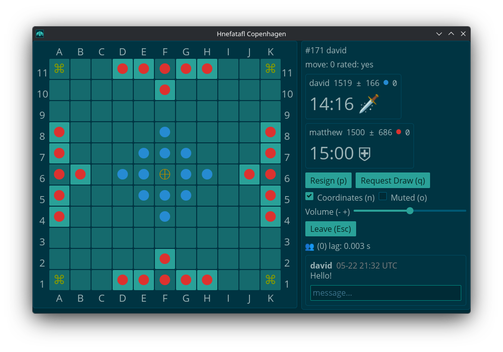

<!-- >
SPDX-FileCopyrightText: 2025 David Campbell <david@hnefatafl.org>
SPDX-License-Identifier: AGPL-3.0-or-later
<-->

<h1 id="hnefatafl">
  <table style="border: none;"><tr>
  <td valign="center"></td>
  <td valign="center"><a class="header" height="100" href="https://hnefatafl.org">
    Hnefatafl Copenhagen
  </a></td>
  </tr><table>
</h1>

[![Discord]][discord-link]&ensp;
[![docs-rs]][docs-rs-link]&ensp;
[![REUSE status]][reuse]&ensp;
[![coverage]][coverage-link]

[Discord]:  https://img.shields.io/badge/Discord-111111?logo=discord
[discord-link]: https://discord.gg/h56CAHEBXd
[docs-rs]: https://img.shields.io/badge/docs.rs-66c2a5?logo=docs.rs
[docs-rs-link]: https://docs.rs/hnefatafl-copenhagen
[REUSE status]: https://api.reuse.software/badge/github.com/dcampbell24/hnefatafl
[reuse]: https://api.reuse.software/info/github.com/dcampbell24/hnefatafl
[coverage]: https://img.shields.io/badge/coverage-32.04%25-red
[coverage-link]: https://dlc.name/hnefatafl



An [engine] similar to the [Go Text Protocol], a [client], and a [server]. For
help on how to use the engine see the module [documentation].

[engine]: https://github.com/dcampbell24/hnefatafl/blob/main/src/bin/hnefatafl-text-protocol.rs
[Go Text Protocol]: https://www.lysator.liu.se/~gunnar/gtp/gtp2-spec-draft2/gtp2-spec.html
[client]: https://github.com/dcampbell24/hnefatafl/tree/main/src/bin/hnefatafl-client
[server]: https://github.com/dcampbell24/hnefatafl/blob/main/src/bin/hnefatafl-server-full
[documentation]: https://docs.rs/hnefatafl-copenhagen/latest/hnefatafl_copenhagen/message/enum.Message.html

## Building and Running

Take a look at all of the [installation options].

[installation options]: https://hnefatafl.org/install.html

## License

Licensed under [AGPLv3](COPYING).

```plain
Copyright (C) 2025-2026 Developers of the hnefatafl-copenhagen project

This program is free software: you can redistribute it and/or modify
it under the terms of the GNU Affero General Public License as published by
the Free Software Foundation, either version 3 of the License, or
(at your option) any later version.

This program is distributed in the hope that it will be useful,
but WITHOUT ANY WARRANTY; without even the implied warranty of
MERCHANTABILITY or FITNESS FOR A PARTICULAR PURPOSE.  See the
GNU Affero General Public License for more details.

You should have received a copy of the GNU Affero General Public License
along with this program.  If not, see <https://www.gnu.org/licenses/>.
```
