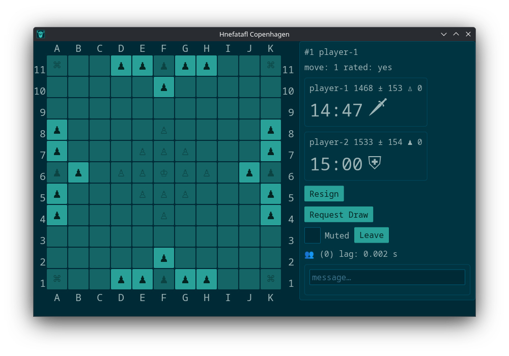

# Copenhagen Hnefatafl

[![github]][github-link]&ensp;[![docs-rs]][docs-rs-link]  
[![AUR package]][aur-link] [![Chocolatey package]][choco-link]
[![crates-io]][crates-io-link] [![flathub]][flathub-link]
[![npm]][npm-link]  
[other packages]  

[github]: https://img.shields.io/badge/github-8da0cb?logo=github
[github-link]: https://github.com/dcampbell24/hnefatafl
[docs-rs]: https://img.shields.io/badge/docs.rs-66c2a5?logo=docs.rs
[docs-rs-link]: https://docs.rs/hnefatafl-copenhagen
[AUR package]: https://img.shields.io/aur/version/hnefatafl-copenhagen
[aur-link]: https://aur.archlinux.org/packages/hnefatafl-copenhagen
[Chocolatey package]:https://img.shields.io/chocolatey/v/hnefatafl-copenhagen
[choco-link]: https://community.chocolatey.org/packages/hnefatafl-copenhagen/
[crates-io]: https://img.shields.io/crates/v/hnefatafl-copenhagen.svg
[crates-io-link]: https://crates.io/crates/hnefatafl-copenhagen
[flathub]: https://img.shields.io/flathub/v/org.hnefatafl.hnefatafl_client
[flathub-link]:  https://flathub.org/apps/org.hnefatafl.hnefatafl_client
[npm]: https://img.shields.io/npm/v/hnefatafl-copenhagen
[npm-link]: https://www.npmjs.com/package/hnefatafl-copenhagen
[other packages]: https://hnefatafl.org/install.html



An [engine] similar to the [Go Text Protocol], a [client], and a [server]. For
help on how to use the engine see the module [documentation].

[engine]: https://github.com/dcampbell24/hnefatafl/blob/main/src/bin/hnefatafl-text-protocol.rs
[Go Text Protocol]: https://www.lysator.liu.se/~gunnar/gtp/gtp2-spec-draft2/gtp2-spec.html
[client]: https://github.com/dcampbell24/hnefatafl/blob/main/examples/hnefatafl-client.rs
[server]: https://github.com/dcampbell24/hnefatafl/blob/main/src/bin/hnefatafl-server-full.rs
[documentation]: https://docs.rs/hnefatafl-copenhagen/latest/hnefatafl_copenhagen/message/enum.Message.html

## Building and Running

First you need to install [Rust]. Then:

```sh
git clone https://github.com/dcampbell24/hnefatafl.git
cd hnefatafl
```

You can pass `-- --help` to any of the following commands to get all of the
runtime options.

Then you can run the engine with:

```sh
cargo run --release --bin hnefatafl-text-protocol -- --display-game
```

or you can start a local server:

```sh
cargo run --release
```

and run a client:

```sh
# On Windows pass to cargo `--features console` to see console output.
# Pass to cargo `--features debug` to enable iced debugging.
cargo run --release --example hnefatafl-client -- --host localhost
```

If you are running on Linux, you'll need some dependencies as [described] on the
[website].

## [Website]

You can also get the [rules] and more information about [downloading]
the software on the website.

[Rust]: https://rust-lang.org/learn/get-started/
[described]: https://hnefatafl.org/install.html#dependencies-linux
[website]: https://hnefatafl.org
[rules]: https://hnefatafl.org/rules.html
[downloading]: https://hnefatafl.org/install.htm

## Discord

Click to join our [Discord server].

[Discord Server]: https://discord.gg/h56CAHEBXd

## Icon

 used for the
flathub version of the hnefatafl-client was created by Marvin T.
[@marvintubat123].

[@marvintubat123]: https://www.freelancer.com/u/marvintubat123

## License

Licensed under [AGPLv3](COPYING).

```plain
Copyright (C) 2025-2026 Developers of the hnefatafl-copenhagen project

This program is free software: you can redistribute it and/or modify
it under the terms of the GNU Affero General Public License as published by
the Free Software Foundation, either version 3 of the License, or
(at your option) any later version.

This program is distributed in the hope that it will be useful,
but WITHOUT ANY WARRANTY; without even the implied warranty of
MERCHANTABILITY or FITNESS FOR A PARTICULAR PURPOSE.  See the
GNU Affero General Public License for more details.

You should have received a copy of the GNU Affero General Public License
along with this program.  If not, see <https://www.gnu.org/licenses/>.
```
