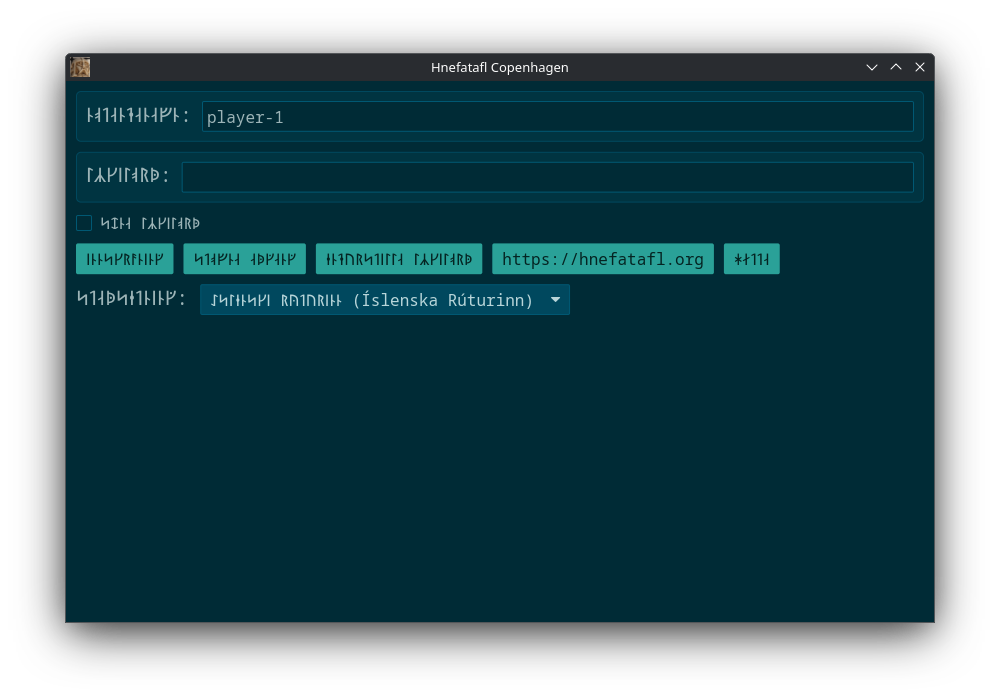

## Install

See how to install the software [here](install.html).

## Rules

See the rules [here](rules.html).

## Artificial Intelligence

Learn about AI [here](ai.html).

## Translate

If you want to add, update, or fix a translation, open an [issue][1] and state
what you want to do. If it is a minor change, you can just update the
[code][3] and submit a [pull request][4].

[3]: https://github.com/dcampbell24/hnefatafl/blob/main/locales/app.yml
[4]: https://github.com/dcampbell24/hnefatafl/pulls

## Discord

Join discord [here](https://discord.gg/h56CAHEBXd).

## Help Me

If you have any issues with the software, open an issue on [github][1].

[1]: https://github.com/dcampbell24/hnefatafl/issues

## Donate

Donate [here](https://github.com/sponsors/dcampbell24).

<a property="dct:title" rel="cc:attributionURL" href="https://hnefatafl.org">Hnefatafl Org</a> by <a rel="cc:attributionURL dct:creator" property="cc:attributionName" href="https://dlc.name">David Lawrence Campbell</a> is licensed under <a href="https://creativecommons.org/licenses/by/4.0/?ref=chooser-v1" target="_blank" rel="license noopener noreferrer" style="display:inline-block;">CC BY 4.0</a>
