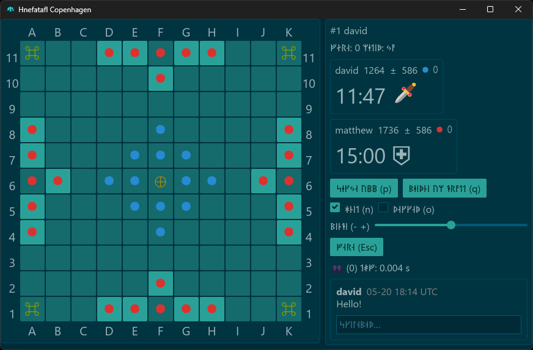

## History

Find out about the [history](history.html) of Hnefatafl.

## Install

See how to [install](install.html) the software.

## Rules

See the [rules](rules.html).

## Tournaments

Learn about [tournaments](tournaments.html).

## Artificial Intelligence

Learn about [AI](ai.html).

## Translate

If you want to add, update, or fix a translation, open an [issue][1] and state
what you want to do. If it is a minor change, you can just update the
[code][3] and submit a [pull request][4].

[3]: https://github.com/dcampbell24/hnefatafl/blob/main/locales/app.yml
[4]: https://github.com/dcampbell24/hnefatafl/pulls

## Discord

[![Discord]](https://discord.gg/h56CAHEBXd)

[Discord]: images/Discord-Logo-Blurple.png

## Help Me

If you have any issues with the software, open an issue on [github][1].

[1]: https://github.com/dcampbell24/hnefatafl/issues

## Donate

<footer>© 2026 David Lawrence Campbell</footer>
