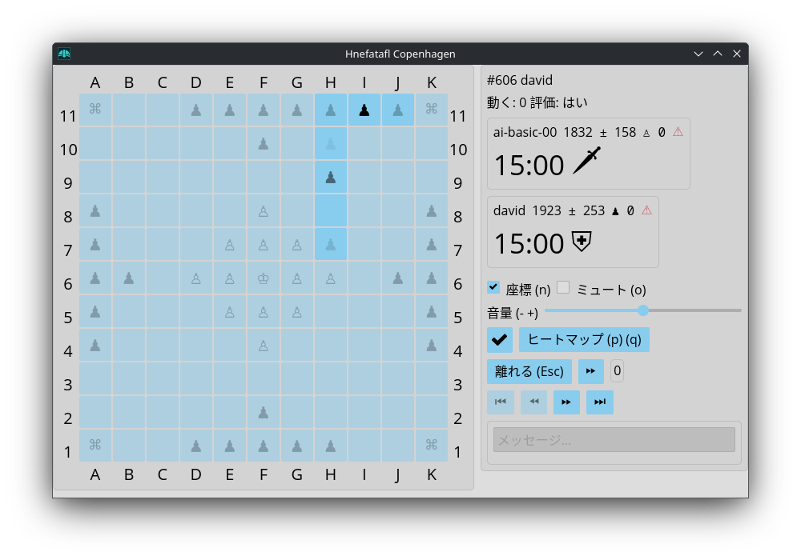

<div id="google_translate_element"></div>
<script type="text/javascript" src="//translate.google.com/translate_a/element.js?cb=googleTranslateElementInit"></script>
<script type="text/javascript">
  function googleTranslateElementInit() {
    new google.translate.TranslateElement({pageLanguage: 'en'}, 'google_translate_element');
  }
</script>



## Artifcial Intelligence

I am working on making a reasonably strong artificial intelligence, but it is
pretty weak at the moment. You can run it via `hnefatafl-ai` on the Arch,
cargo, and Debian installs, or via the source package. See `--help` for
what options you can pass it.

You'll have to create an account for it first on whatever server you will be
running it on. Run `hnefatafl-client` and log onto the server. Then, Create an
account for your AI, prefixing the username with `ai-`.

It can also be run as a service for the Arch and Debian installs. Edit the file
`/etc/hnefatafl-ai-attacker.conf` or `/etc/hnefatafl-ai-defender.conf` and add

```sh
USERNAME=username
PASSWORD=password
```

Don't prefix the `USERNAME` with `ai-` here.

Then run

```sh
sudo systemctl start hnefatafl-ai-attacker
```

or

```sh
sudo systemctl start hnefatafl-ai-defender
```

If you want to change the settings for the AI further, you can edit
`/usr/lib/systemd/system/hnefatafl-ai-attacker.service` or
`/usr/lib/systemd/system/hnefatafl-ai-defender.service` and change the value of
`ExecStart`.

By default this runs basic AI with a search depth of 4. The AI seems pretty
weak if you go below 4. You can increase the depth, but the AI may run very
slowly.

Be warned that by default this runs in parallel using all available CPUs. If
you only want to use one CPU, you can pass `--sequential`.

<p xmlns:cc="http://creativecommons.org/ns#" xmlns:dct="http://purl.org/dc/terms/"><a property="dct:title" rel="cc:attributionURL" href="https://hnefatafl.org">Hnefatafl Org</a> by <a rel="cc:attributionURL dct:creator" property="cc:attributionName" href="https://dlc.name">David Lawrence Campbell</a> is licensed under <a href="https://creativecommons.org/licenses/by/4.0/?ref=chooser-v1" target="_blank" rel="license noopener noreferrer" style="display:inline-block;">CC BY 4.0</a></p>
