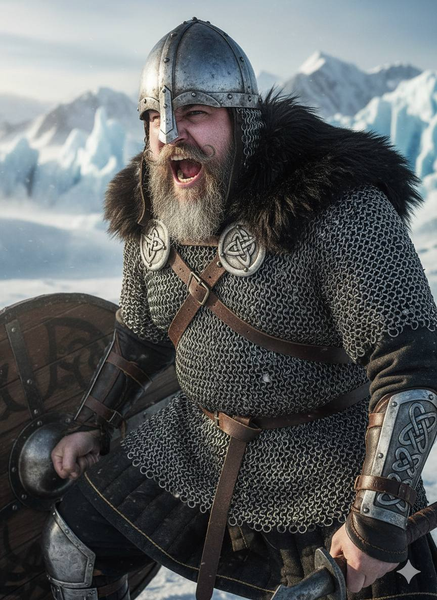

From [Wikipedia](https://en.wikipedia.org/wiki/Tafl_games):

## Tafl Games

Tafl games (pronounced [tavl]), also known as hnefatafl games, are a family of
ancient Northern European strategy board games played on a checkered or
latticed gameboard with two armies of uneven numbers. Names of different
variants of tafl include hnefatafl, tablut, tawlbwrdd, brandubh, Ard Rí, and
alea evangelii. Games in the tafl family were played in Norway, Sweden,
Denmark, Iceland, Britain, Ireland, and Sápmi.

Tafl gaming was eventually supplanted by chess in the 12th century, but
the tafl variant of the Sámi people, tablut, was in play until at least the
18th century. The rules for tablut were written down by the Swedish naturalist
Linnaeus in 1732, and these were translated from Latin to English in 1811. All
modern tafl games are based on the 1811 translation, which had many errors.

New rules were added to amend the issues resulting from these errors, leading
to the creation of a modern family of tafl games. In addition, tablut is now
also played in accordance with its original rules, which have been
retranslated.

### Hnefatafl

Hnefatafl (sometimes now referred to as Viking chess) was a popular game in
medieval Scandinavia and was mentioned in several of the Norse sagas. Some of
these saga references have contributed to controversy over the possible use of
dice in playing hnefatafl.

The rules of the game were never explicitly recorded, and only playing pieces
and fragmentary boards are extant, so it is not known for sure how the game was
played. If dice were in fact used, nothing has been recorded about how they
were employed. Archaeological and literary sources indicate hnefatafl may have
been played on a 13×13 or an 11×11 board.

Hnefatafl became a popular game in Northern Europe during the Viking era (end
of the 8th century to 1000 CE), a turbulent time full of conflicts. When chess
became a popular game during the Middle Ages, the rules of hnefatafl were
forgotten over time. Hnefatafl was particularly popular in Nordic countries
and followed the Viking civilization to other parts of Europe, primarily to
the British Isles and the Viking country of Garðaríki in what is now part of
Russia.

The game developed differently at different locations. Archaeologists have
found editions in places such as Ireland and Ukraine. Hnefatafl literally
translates to "fist table", from the Old Norse (equivalently in modern
Icelandic) hnef, 'fist', and tafl, 'table'.

### Modern Hnefatafl

The rules for Norse tafl were lost, but in the 1900s attempts were made to
reconstruct the game based on the rules for the Sámi tafl game tablut. The
rules for tablut had been written down in the 1700s, and translated from Latin
to English in the 1800s (see § Tablut). Unfortunately, the rules were poorly
translated from Latin and gave unbalanced gameplay, mainly due to the mistaken
idea that the king must be surrounded on four sides to be captured – instead
of two.

Different innovations were made to create a game that favoured the
defender side less, such as limiting the king's escape possibilities to the
corners (instead of the entire edge of the board), making the king "weaponless"
(unable to participate in capture), making the initial starting points of the
attackers inaccessible for the king, and making it easier to capture the king
against the corner fields of the board.

Today, many different versions of modern hnefatafl are in play – both online
and on physical boards that are sold commercially. One variant used in
tournaments is Copenhagen hnefatafl, which also features a "shield wall"
mechanism to capture several soldiers at once, and an "exit fort" rule that
enables the king to escape on the edge while otherwise being limited to escape
in the corners.
