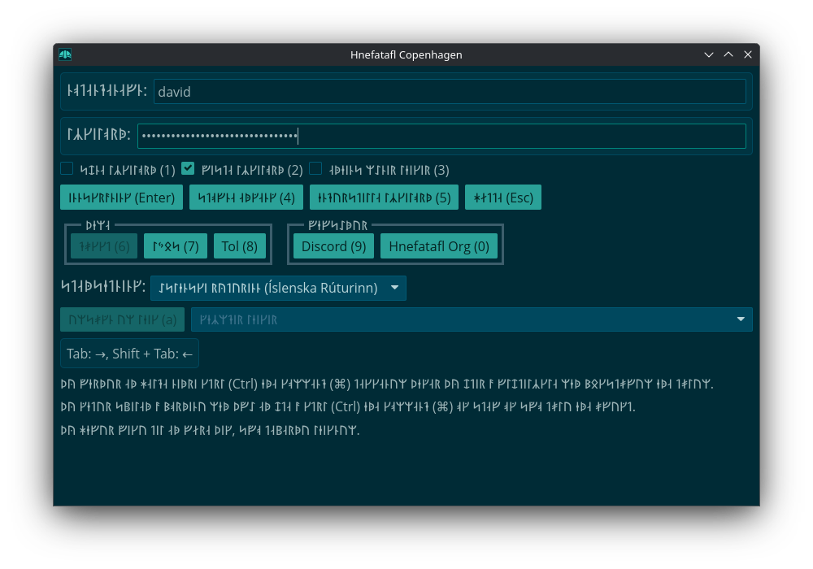

<div id="google_translate_element"></div>
<script type="text/javascript" src="//translate.google.com/translate_a/element.js?cb=googleTranslateElementInit"></script>
<script type="text/javascript">
  function googleTranslateElementInit() {
    new google.translate.TranslateElement({pageLanguage: 'en'}, 'google_translate_element');
  }
</script>

## Arch and Derivatives (Linux) [![AUR]][aur-link]

In your terminal run:

```sh
sudo pacman --sync yay
yay --sync hnefatafl-copenhagen
```

Then under KDE go to `Application Launcher -> Games -> Hnefatafl Copenhagen`
or in a terminal run `\usr\bin\hnefatafl-client`.

[AUR]: https://img.shields.io/aur/version/hnefatafl-copenhagen
[aur-link]: https://aur.archlinux.org/packages/hnefatafl-copenhagen

## Chocolatey (Windows) [![chocolatey]][choco-link]

Install [Chocolatey](https://chocolatey.org/install).

Then install [hnefatafl-copenhagen](https://community.chocolatey.org/packages/hnefatafl-copenhagen/).

Go to the Start menu and run Hnefatafl.

[chocolatey]: https://img.shields.io/chocolatey/v/hnefatafl-copenhagen
[choco-link]: https://community.chocolatey.org/packages/hnefatafl-copenhagen/

## Debian and Derivatives (Linux)

Download [hnefatafl.list][1] to `/etc/apt/sources.list.d/` or:

```sh
echo 'deb [arch=amd64 signed-by=/etc/apt/keyrings/packages.hnefatafl.org.asc] https://hnefatafl.org/apt stable main' \
| sudo tee /etc/apt/sources.list.d/hnefatafl.list
```

Then, Download [packages.hnefatafl.org.asc][2] to `/etc/apt/keyrings/` or:

```sh
wget https://hnefatafl.org/packages.hnefatafl.org.asc
sudo mv packages.hnefatafl.org.asc /etc/apt/keyrings/
```

Then in your terminal run:

```sh
sudo apt update && sudo apt install hnefatafl-copenhagen
```

[1]: hnefatafl.list
[2]: packages.hnefatafl.org.asc

Then under KDE go to `Application Launcher -> Games -> Hnefatafl Copenhagen`
or in a terminal run `\usr\games\hnefatafl-client`.

## Cargo (Linux, macOS, Windows) [![crates-io]][crates-io-link]

### Dependencies (Linux)

ALSA development files are needed to build `cpal` on Linux (`rodio` dependency,
`hnefatafl-client` dependency). These are provided as part of the
`alsa-lib` package on Arch, `libasound2-dev` package on Debian and Ubuntu, and
`alsa-lib-devel` on Fedora.

The package uses the `mold` linker. This is provided via the `mold`
package on Arch, Debian, Ubuntu, and Fedora.

### Run

In your terminal run the following to run the client with [Rust's] cargo:

```sh
cargo install hnefatafl-copenhagen
hnefatafl-client
```

[crates-io]: https://img.shields.io/crates/v/hnefatafl-copenhagen.svg
[crates-io-link]: https://crates.io/crates/hnefatafl-copenhagen
[Rust's]: https://www.rust-lang.org/learn/get-started

## Flatpak (Linux) [![flathub]][flathub-link]

See [flathub.org](https://flathub.org/apps/org.hnefatafl.hnefatafl_client).

Or after installing the application under KDE go to
`Application Launcher -> Games -> Hnefatafl Copenhagen`

[flathub]: https://img.shields.io/flathub/v/org.hnefatafl.hnefatafl_client
[flathub-link]: https://flathub.org/apps/org.hnefatafl.hnefatafl_client

## F-Droid (Android)

1. Go to [Google](https://myaccount.google.com/security). Scroll down to `Enhanced
   Safe Browsing for your account`. If it is on, turn it off.
2. Go to [F-Droid](f-droid.org) and download F-Droid.
3. Open F-Droid, go to search, and install `Termux: Terminal emulator with packages`.
4. Open Termux, then run the following:

```sh
# Only need to run this once per update.

pkg upgrade
termux-change-repo
pkg install rust git x11-repo
pkg install xfce termux-x11-nightly
git clone https://github.com/termux/termux-packages termux-packages-hnefatafl-copenhagen-dest
git clone -b hnefatafl-copenhagen https://github.com/robertkirkman/termux-packages termux-packages-hnefatafl-copenhagen-src
cp -r termux-packages-hnefatafl-copenhagen-src/x11-packages/hnefatafl-copenhagen/ termux-packages-hnefatafl-copenhagen-dest/x11-packages/
cd termux-packages-hnefatafl-copenhagen-dest
scripts/setup-termux.sh
./build-package.sh -I -f hnefatafl-copenhagen
cd output/
apt reinstall ./hnefatafl-copenhagen*.deb
```

```sh
# Repeat this every time you want to run the program.

export LIBGL_ALWAYS_SOFTWARE=1 DISPLAY=:0
termux-x11 -xstartup xfce4-session &
hnefatafl-client --ascii
```

Then go to `Termux:X11` from the main menu. You may need to hold `Termux:11` to
go to the `Preferences` -> `Output`, then increase the `Display scale %`.

## NPM [![npm]][npm-link]

[npm]: https://img.shields.io/npm/v/hnefatafl-copenhagen
[npm-link]: https://www.npmjs.com/package/hnefatafl-copenhagen

```sh
# With Apache and Firefox on Debian.
sudo npm install -g hnefatafl-copenhagen
sudo mkdir --parent /var/www/html/pkg
sudo cp /usr/lib/node_modules/hnefatafl-copenhagen/ -r pkg /var/www/html
```

Then load the javascript on a webpage:

```sh
cat << EOF > /var/www/html/index.html
<!DOCTYPE html>
<html>
<head>
    <title>Copenhagen Hnefatafl</title>
</head>
<body>
    <h1>Copenhagen Hnefatafl</h1>
    <script type="module">
        import init, { Game } from '../pkg/hnefatafl_copenhagen.js';

        init().then(() => {
            const game = new Game();
            const output = game.read_line_js("show_board");
            console.log(output);
        });
    </script>
</body>
</html>
EOF
```

See the [message protocol] for all of the commands available.

[message protocol]: https://docs.rs/hnefatafl-copenhagen/latest/hnefatafl_copenhagen/message/enum.Message.html

```sh
# With Apache running.
firefox localhost
```

## Redox [@](https://www.redox-os.org/)

Edit your user config to include:

```toml
[packages]
hnefatafl-copenhagen = "source"
```

You should be at least using the packages supplied via
`include = ["desktop-minimal.toml"]`. Go to games and open Hnefatafl or run
`/usr/games/hnefatafl-client`. After logging in and exiting the application,
you'll have to restart Redox, because the application is buggy.

There are also at least these bugs:

1. There are no CJK fonts.
2. On a button press two characters are read in instead of one.
3. Backspace does not work.
4. I think you have to restart Redox after entering the application, because
   TcpStream shutdown is not implemented.

## Note

At the moment their may be fairly regular updates. If you run into problems,
make sure you are running the latest version.

<p xmlns:cc="http://creativecommons.org/ns#" xmlns:dct="http://purl.org/dc/terms/"><a property="dct:title" rel="cc:attributionURL" href="https://hnefatafl.org">Hnefatafl Org</a> by <a rel="cc:attributionURL dct:creator" property="cc:attributionName" href="https://dlc.name">David Lawrence Campbell</a> is licensed under <a href="https://creativecommons.org/licenses/by/4.0/?ref=chooser-v1" target="_blank" rel="license noopener noreferrer" style="display:inline-block;">CC BY 4.0</a></p>
