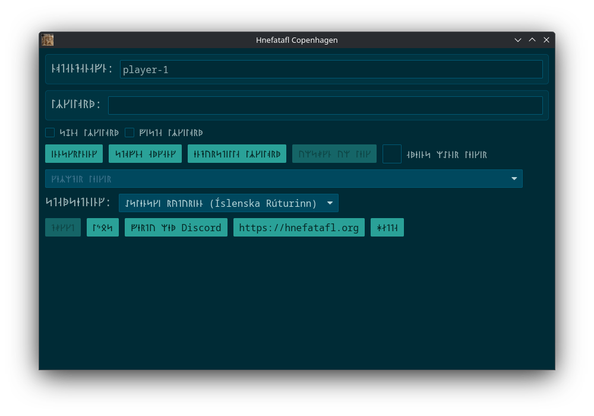

<div id="google_translate_element"></div>
<script type="text/javascript" src="//translate.google.com/translate_a/element.js?cb=googleTranslateElementInit"></script>
<script type="text/javascript">
  function googleTranslateElementInit() {
    new google.translate.TranslateElement({pageLanguage: 'en'}, 'google_translate_element');
  }
</script>

## Arch and Derivatives (Linux)

In your terminal run:

```sh
yay --sync hnefatafl-copenhagen
```

## Chocolatey (Windows)

Install [Chocolatey](https://chocolatey.org/install).

Then install [hnefatafl-copenhagen](https://community.chocolatey.org/packages/hnefatafl-copenhagen/).

## Debian and Derivatives (Linux)

Download [hnefatafl.list][1] to `/etc/apt/sources.list.d/`.

Then, Download [packages.hnefatafl.org.asc][2] to `/etc/apt/keyrings/`.

Then in your terminal run:

```sh
sudo apt update && sudo apt install hnefatafl-copenhagen
```

[1]: hnefatafl.list
[2]: packages.hnefatafl.org.asc

## Flatpak (Linux)

See [flathub.org](https://flathub.org/apps/org.hnefatafl.hnefatafl_client).

## F-Droid (Android)

1. Go to [Google](https://myaccount.google.com/security). Scroll down to `Enhanced
   Safe Browsing for your account`. If it is on, turn it off.
2. Go to [F-Droid](f-droid.org) and download F-Droid.
3. Open F-Droid, go to search, and install `Termux: Terminal emulator with packages`.
4. Open Termux, then run the following:

```sh
# Only need to run this once per update.

pkg upgrade
termux-change-repo
pkg install rust git x11-repo
pkg install xfce termux-x11-nightly
git clone https://github.com/termux/termux-packages termux-packages-hnefatafl-copenhagen-dest
git clone -b hnefatafl-copenhagen https://github.com/robertkirkman/termux-packages termux-packages-hnefatafl-copenhagen-src
cp -r termux-packages-hnefatafl-copenhagen-src/x11-packages/hnefatafl-copenhagen/ termux-packages-hnefatafl-copenhagen-dest/x11-packages/
cd termux-packages-hnefatafl-copenhagen-dest
scripts/setup-termux.sh
./build-package.sh -I -f hnefatafl-copenhagen
cd output/
apt reinstall ./hnefatafl-copenhagen*.deb
```

```sh
# Repeat this every time you want to run the program.

export LIBGL_ALWAYS_SOFTWARE=1 DISPLAY=:0
termux-x11 -xstartup xfce4-session &
hnefatafl-client --ascii
```

Then go to `Termux:X11` from the main menu. You may need to hold `Termux:11` to
go to the `Preferences` -> `Output`, then increase the `Display scale %`.

## Redox [@](https://www.redox-os.org/)

Edit your user config to include:

```toml
[packages]
hnefatafl-copenhagen = "source"
```

You should be at least using the packages supplied via
`include = ["desktop.toml"]`. Go to games and open Hnefatafl. After logging in
and exiting the application, you'll have to restart Redox, because the
application is buggy.

There are also at least these bugs:

1. There are no CJK fonts.
2. On a button press two characters are read in instead of one.
3. Backspace does not work.
4. I think you have to restart Redox after entering the application, because
   TcpStream shutdown is not implemented.

## Cargo (Linux, macOS, Windows)

### Dependencies (Linux)

ALSA development files are needed to build `cpal` on Linux (`rodio` dependency,
`hnefatafl-client` dependency). These are provided as part of the
`alsa-lib` package on Arch, `libasound2-dev` package on Debian and Ubuntu, and
`alsa-lib-devel` on Fedora.

The package uses the `mold` linker. This is provided via the `mold`
package on Arch, Debian, Ubuntu, and Fedora.

### Run

In your terminal run the following to run the client with [Rust's][3] cargo:

```sh
cargo install hnefatafl-copenhagen
RUST_LOG=hnefatafl_client=info hnefatafl-client
```

[3]: https://www.rust-lang.org/learn/get-started

## Note

At the moment their may be fairly regular updates. If you run into problems,
make sure you are running the latest version.

<p xmlns:cc="http://creativecommons.org/ns#" xmlns:dct="http://purl.org/dc/terms/"><a property="dct:title" rel="cc:attributionURL" href="https://hnefatafl.org">Hnefatafl Org</a> by <a rel="cc:attributionURL dct:creator" property="cc:attributionName" href="https://dlc.name">David Lawrence Campbell</a> is licensed under <a href="https://creativecommons.org/licenses/by/4.0/?ref=chooser-v1" target="_blank" rel="license noopener noreferrer" style="display:inline-block;">CC BY 4.0</a></p>
