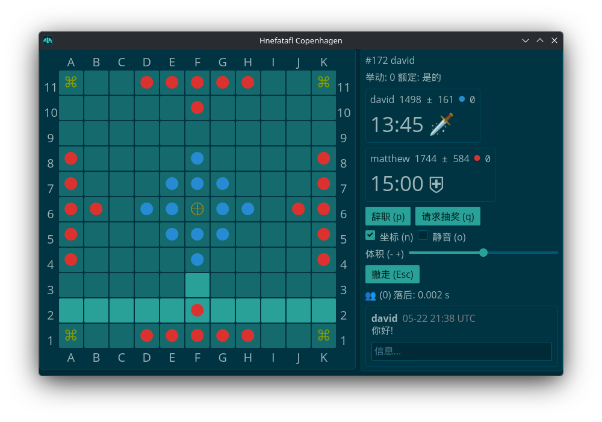
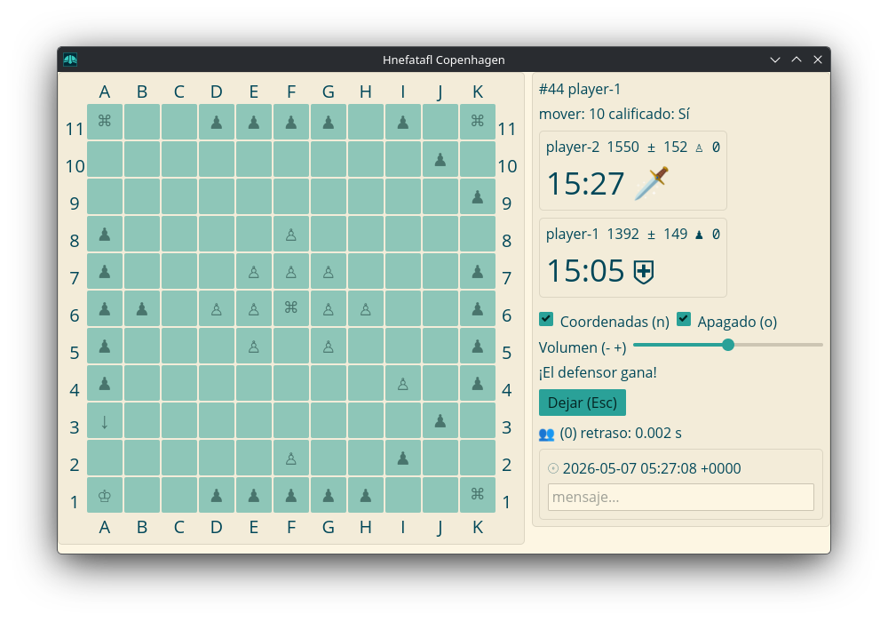
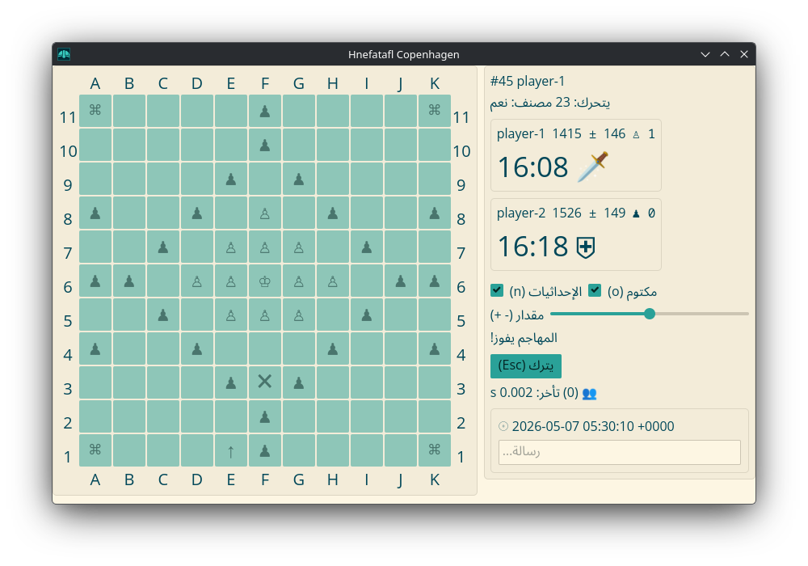

## Rules

From [Copenhagen Hnefatafl][1] with minor changes.

The Copenhagen rules were outlined 2012 by Aage Nielsen (Denmark), Adam Bartley
(Norway) and Tim Millar (UK). English text and diagrams: Adam Bartley (Norway)

Based on the version that was last updated 21.12.2024.

Copyright © 1998-2025 Aage Nielsen, All Rights Reserved;

`A`: attacker  
`a`: captured attacker  
`K`: king  
`k`: captured king  
`D`: defender  
`d`: captured defender  
`#`: restricted space  

[1]: https://aagenielsen.dk/copenhagen_rules.php

### 1. Starting Board Position


### 2. First Turn

The attackers move first.

### 3. Movement

You can move to the edge of the board or another piece orthogonally:



### 4. Capture

All pieces except the king are captured if sandwiched between two enemy
pieces, or between an enemy piece and a restricted square. A piece is only
captured if the trap is closed by the aggressor's move, it is therefore
permitted to move in between two enemy pieces. The king may take part in
captures.

#### Captures

```plain
  ┌───────────────────────┐ ┌───────────────────────┐
11│ # . . . . . . . . . # │ │ # . . . . . . . . . # │
10│ . . . . . . . . . . . │ │ . . . . . . . . . . . │
 9│ . . . . . . . . . . . │ │ . . . . . . . . . . . │
 8│ . . . . . . . . . . . │ │ . . . . . . . . . . . │
 7│ . . . . . . . . . . . │ │ . . . . . . . . . . . │
 6│ . . . . . # . . . . . │ │ . . . A . # . . . . . │
 5│ . . . . . d . . . . . │ │ . . . d . . . . . . . │
 4│ . → . . . A . . . . . │ │ . A d A d A . . . . . │
 3│ . . . . . . . . . . . │ │ . . . . . . . . . . . │
 2│ . . . . . . . . . . . │ │ . . . ↑ . . . . . . . │
 1│ # . . . . . . . . . # │ │ # . . . . . . . . . # │
  └───────────────────────┘ └───────────────────────┘
    A B C D E F G H I J K     A B C D E F G H I J K
```

```plain
  ┌───────────────────────┐ ┌───────────────────────┐
11│ # . . . . . . . . . # │ │ # d A . . . . . . . # │
10│ . . . . . . . . . . . │ │ . . . . . . . . . . . │
 9│ . . . . . . . . . . . │ │ . . ↑ . . . . . . . . │
 8│ . . . . . . . . . . . │ │ . . . . . . . . . . . │
 7│ . . . . . . . . . . . │ │ . . . . . . . . . . . │
 6│ . . ↓ . . # . . . . . │ │ . . . . . # . . . . . │
 5│ . . . . . . . . . . . │ │ . . . . . . . . . . . │
 4│ . . K . . . . . . . . │ │ . . . . . . . . . . . │
 3│ . . a . . . . . . . . │ │ . . . . . . . . . . . │
 2│ . . D . . . . . . . . │ │ . . . . . . . . . . . │
 1│ # . . . . . . . . . # │ │ # . . . . . . . . . # │
  └───────────────────────┘ └───────────────────────┘
    A B C D E F G H I J K     A B C D E F G H I J K
```

#### Doesn't Capture

```plain
  ┌───────────────────────┐ ┌───────────────────────┐
11│ # . . . . . . . . . # │ │ # . . . . . . . . . # │
10│ . . . . . . . . . . . │ │ . . . . . . . . . . . │
 9│ . . . . . . . . . . . │ │ . . . . . . . . . . . │
 8│ . . . . . . . . . . . │ │ . . . . . . . . . . . │
 7│ . . . . . . . . . . . │ │ . . . . . . . . . . . │
 6│ . . . . . K . . . . . │ │ . . . . . # . . . . . │
 5│ . . . . . D . . . . . │ │ . D A D . . . . . . . │
 4│ . → . . . A . . . . . │ │ . . . . . . . . . . . │
 3│ . . . . . . . . . . . │ │ . . ↑ . . . . . . . . │
 2│ . . . . . . . . . . . │ │ . . . . . . . . . . . │
 1│ # . . . . . . . . . # │ │ # . . . . . . . . . # │
  └───────────────────────┘ └───────────────────────┘
    A B C D E F G H I J K     A B C D E F G H I J K
```

#### Shield Wall

A row of two or more taflmen along the board edge may be captured together, by
bracketing the whole group at both ends, as long as every member of the row has
an enemy taflman directly in front of him.

A corner square may stand in for one of the bracketing pieces at one end of the
row. The king may take part in the capture, either as part of the shield wall
or as a bracketing piece. If the king plus one or more defenders are attacked
with a shield wall, the attack will capture the defenders but not the king.

```plain
  ┌───────────────────────┐ ┌───────────────────────┐
11│ # . . . . . . . . . # │ │ # . . . . . . . . . # │
10│ . . . . . . . . . . . │ │ . . . . . . . . . . . │
 9│ . . . . . . . . . . . │ │ . . . . . . . . . . . │
 8│ . . . . . . . . . . . │ │ . . . . . . . . . . . │
 7│ . . . . . . . . . . . │ │ . . . . . . . . . . . │
 6│ . . . . . # . . . . . │ │ . . . . . # . . . . . │
 5│ . . . . . . . . . . . │ │ . . . . . . . . . . . │
 4│ . . . . . . . . . . . │ │ . . . . . . . . . . . │
 3│ . . ↓ . . . . . . . . │ │ . . . . . . . . . . . │
 2│ . . . D D D . . . . . │ │ . . . . . . . . A A . │
 1│ # . D a a a D . . . # │ │ # . . . . → . A K d # │
  └───────────────────────┘ └───────────────────────┘
    A B C D E F G H I J K     A B C D E F G H I J K
```

### 5. Restricted Squares

Restricted squares may only be occupied by the king. The central restricted
square is called the throne. It is allowed for the king to re-enter the throne,
and all pieces may pass through the throne when it is empty.

Restricted squares are hostile, which means they can replace one of the two
pieces taking part in a capture. The throne is always hostile to the attackers,
but only hostile to the defenders when it is empty.

The four corner squares are also restricted and hostile, just like the throne.
The board edge is _NOT_ hostile.

```plain
  ┌───────────────────────┐
11│ # . . . . . . . . . # │
10│ . . . . . . . . . . . │
 9│ . . . . . . . . . . . │
 8│ . . . . . . . . . . . │
 7│ . . . . . . . . . . . │
 6│ . . . . . # . . . . . │
 5│ . . . . . . . . . . . │
 4│ . . . . . . . . . . . │
 3│ . . . . . . . . . . . │
 2│ . . . . . . . . . . . │
 1│ # . . . . . . . . . # │
  └───────────────────────┘
    A B C D E F G H I J K
```

### 6. King's Side Win (Defenders)

If the king reaches any corner square, the king has escaped and his side wins.



#### Exit Forts

The defenders also win if the king has contact with the board edge, is able to
move, and it is impossible for the attackers to break the fort.

```plain
  ┌───────────────────────┐ ┌───────────────────────┐
11│ # . . . . . . . . . # │ │ # . . . . . . . . . # │
10│ . . . . . . . . . . . │ │ . . . . . . . . . . . │
 9│ . . . . . . . . . . . │ │ . . . . . . . . . . . │
 8│ . . . . . . . . . . . │ │ . . . . . . . . . . . │
 7│ . . . . . . . . . . . │ │ . . . . . . . . . . . │
 6│ . . . . . # . . . . . │ │ . . . . . # . . . . . │
 5│ . . . . . . . . . . . │ │ . . . . . . . . . . . │
 4│ . . . . . . . . . . . │ │ . . . . . . . . . . . │
 3│ . . . . . . . . . . . │ │ . . . . D D . . . . . │
 2│ . . . . D D . . . . . │ │ . . . . D . D . . . . │
 1│ # . . D K . D . . . # │ │ # . . . D K D . . . # │
  └───────────────────────┘ └───────────────────────┘
    A B C D E F G H I J K     A B C D E F G H I J K
```

### 7. Attackers Win

The attackers win if they can capture the king.

The king is captured when the attackers surround him on all four cardinal
points, except when he is next to the throne.

If on a square next to the throne, the attackers must occupy the three remaining
squares around him and be the one to move.

The king cannot be captured on the board edge.

#### The King is Captured

```plain
  ┌───────────────────────┐ ┌───────────────────────┐ ┌───────────────────────┐
11│ # . . . . . . . . . # │ │ # . . . . . . . . . # │ │ # . . . . . . . . . # │
10│ . . . . . . . . . . . │ │ . . . . . . . . . . . │ │ . . . . . . . . . . . │
 9│ . . . . . . . . . . . │ │ . . . . . . . . . . . │ │ . . . . . . . . . . . │
 8│ . . . . . . . . . . . │ │ . . . . . . . . . . . │ │ . . . . . . . . . . . │
 7│ . . . . . A . . . . . │ │ . . . . . . . . . . . │ │ . . . . . . . . . . . │
 6│ . . . . A k A . . . . │ │ . . . . . # . . . . . │ │ . . . . . # . . . . . │
 5│ . . . . . A . . . . . │ │ . . . . A k A . . . . │ │ . . . . . . . . . . . │
 4│ . . . . . . . . . . . │ │ . . . . . A . . . . . │ │ . . . . A . . . . . . │
 3│ . . . . . . . . . . . │ │ . . . . . . . . . . . │ │ . . . A k A . . . . . │
 2│ . . . . . . . . . . . │ │ . . . . . ↑ . . . . . │ │ . . . . A . . . . . . │
 1│ # . . . . . . . . . # │ │ # . . . . . . . . . # │ │ # . . . . . . . . . # │
  └───────────────────────┘ └───────────────────────┘ └───────────────────────┘
    A B C D E F G H I J K     A B C D E F G H I J K     A B C D E F G H I J K
```

If the attackers surround the king and _ALL_ remaining defenders with an
unbroken ring, then they win, as they have prevented the king from escaping.



#### The King is Not Captured

```plain
  ┌───────────────────────┐ ┌───────────────────────┐
11│ # . . . . . . . . . # │ │ # . . . . . . . . . # │
10│ . . . . . . . . . . . │ │ . . . . . . . . . . . │
 9│ . . . . . . . . . . . │ │ . . . . . . . . . . . │
 8│ . . . . . . . . . . . │ │ . . . . . . . . . . . │
 7│ . . . . . . . . . . . │ │ . . . . . . . . . . . │
 6│ . . . . . # . . . . . │ │ . . . . . # . . . . . │
 5│ . . . . . . . . . . . │ │ . . . . . . . . . . . │
 4│ . . . . . . . . . . . │ │ . . . . . . . . . . . │
 3│ . . . . . . . . . . . │ │ . . . . . . . . . . . │
 2│ . . . . A . . . . . . │ │ . A . . . . . . . . . │
 1│ # . . A K A . . . . # │ │ # K A . . . . . . . # │
  └───────────────────────┘ └───────────────────────┘
    A B C D E F G H I J K     A B C D E F G H I J K
```

### 8. Perpetual Repetitions

#### Deleted Rule

Perpetual repetitions are forbidden. Any perpetual repetition results in a loss
for the defenders.

#### Added Rule

If the defender would repeat a board position, the move is not allowed.

### 9. Automatic Loss

If a player cannot move, he loses the game.

### 10. Defenders Can't Escape, Attackers Win

When the defenders don't have enough pieces left to make an exit fort and the
corners are blocked.

```plain
  ┌───────────────────────┐
11│ # . A . . . . . A . # │
10│ . A . . . . . . . A . │
 9│ A . . . . . . . . . A │
 8│ . . . . . . . . . . . │
 7│ . . . . . . . . . . D │
 6│ A . . . . # . . . D K │
 5│ . . . . . . . . . . D │
 4│ . . . . . . . . . . . │
 3│ A . . . . . . . . . A │
 2│ . A . . . . . . . A . │
 1│ # . A . . . . . A . # │
  └───────────────────────┘
    A B C D E F G H I J K
```

When the attackers have all corners blocked and only two spaces left on any
side.

```plain
  ┌───────────────────────┐
11│ # . . . . A . . A . # │
10│ . . . . A . . . . A . │
 9│ . . . A . . . . . . A │
 8│ . . A . . . . . D D D │
 7│ . . A . . . . D . K D │
 6│ . . A . . # . D D D A │
 5│ . . A . . . . . . . A │
 4│ . . A . . . . . . . A │
 3│ . . . A . . . . . . A │
 2│ . . . . A . . . . A . │
 1│ # . . . . A . . A . # │
  └───────────────────────┘
    A B C D E F G H I J K
```

Not added to the game engine below this line.

---

When the king is trapped.

```plain
  ┌───────────────────────┐ ┌───────────────────────┐┌───────────────────────┐
11│ # A K A A . . . . . # │ │ # A K A A . . . . . # │ │ # A K A A . . . . . # │
10│ . A A . . . . . . . . │ │ A . A . . . . . . . . │ │ . . A . A . . . . . . │
 9│ . A A . . . . . . . . │ │ A A A . . . . . . . . │ │ . . A A . . . . . . . │
 8│ . . . . . . . . . . . │ │ . . . . . . . . . . . │ │ . . . . . . . . . . . │
 7│ . . . . . . . . . . . │ │ . . . . . . . . . . . │ │ . . . . . . . . . . . │
 6│ A . . . . # . . . . D │ │ A . . . . # . . . . D │ │ A . . . . # . . . . D │
 5│ . . . . . . . . . . D │ │ . . . . . . . . . . D │ │ . . . . . . . . . . D │
 4│ . . . . . . . . . . . │ │ . . . . . . . . . . . │ │ . . . . . . . . . . . │
 3│ . . . . . . . . . . . │ │ . . . . . . . . . . . │ │ . . . . . . . . . . . │
 2│ . . . . . . . . . . . │ │ . . . . . . . . . . . │ │ . . . . . . . . . . . │
 1│ # . . . . . . . . . # │ | # . . . . . . . . . # │ | # . . . . . . . . . # │
  └───────────────────────┘ └───────────────────────┘ └───────────────────────┘
    A B C D E F G H I J K     A B C D E F G H I J K     A B C D E F G H I J K
```

```plain
  ┌───────────────────────┐ ┌───────────────────────┐ ┌───────────────────────┐
11│ # A K A A . . . . . # │ │ # . . . . . . . . . # │ │ # . . . . . . . . . # │
10│ . . A A . . . . . . . │ │ . . . . . . . . . . . │ │ . . . . . . . . . . . │
 9│ . . A A . . . . . . . │ │ . . . . . . . . . . . │ │ . . . . . . . . . . . │
 8│ . . . . . . . . . . . │ │ . . . . . . . . . . . │ │ . . . . . . . . . . . │
 7│ . . . . . . . . . . . │ │ . . . . . . . . . . . │ │ . . . . . . . . . . . │
 6│ A . . . . # . . . . D │ │ A . . . . # . . . . D │ │ A . . . . # . . . . D │
 5│ . . . . . . . . . . D │ │ . . . . . . . . . . D │ │ . . . . . . . . . . D │
 4│ . . . . . . . . . . . │ │ . . . . . . . . . . . │ │ . . . . . . . . . . . │
 3│ . . . . . . . . . . . │ │ . . . . . A A . . . . │ │ . . . . . A A . . . . │
 2│ . . . . . . . . . . . │ │ . . . . . A A . . . . │ │ . . . . . A . A . . . │
 1│ # . . . . . . . . . # │ │ # . . A A K A A . . # │ │ # . . A A K A A . . # │
  └───────────────────────┘ └───────────────────────┘ └───────────────────────┘
    A B C D E F G H I J K     A B C D E F G H I J K    A B C D E F G H I J K
```
