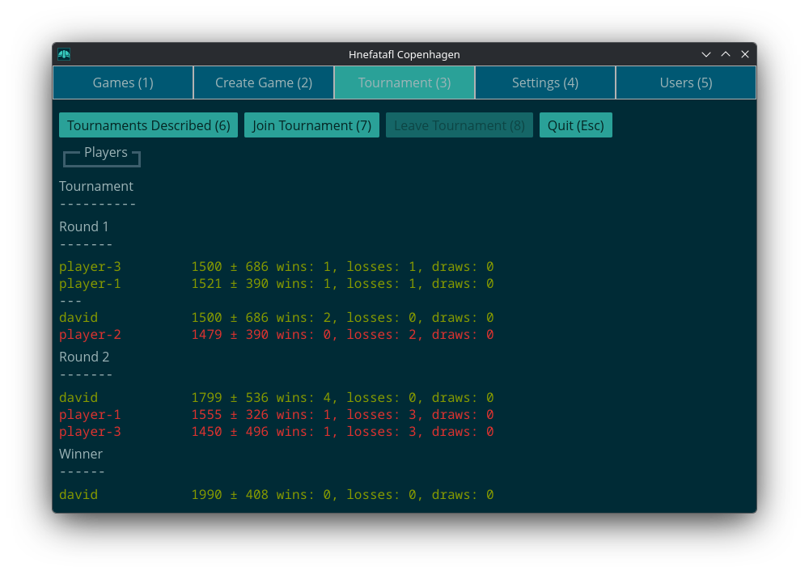

<div id="google_translate_element"></div>
<script type="text/javascript" src="//translate.google.com/translate_a/element.js?cb=googleTranslateElementInit"></script>
<script type="text/javascript">
  function googleTranslateElementInit() {
    new google.translate.TranslateElement({pageLanguage: 'en'}, 'google_translate_element');
  }
</script>

## Tournaments

A game starts when a round starts, having a fischer time of three days main
time and six hour increments.

Play continues until a round in which there is only one player left or all
players got the same number of wins, losses, and draws in the last round. A
round is broken up into groups of N players. N being what was passed in the
argument `--group-size`, defaulting to four. Play within a group consists of
every player playing every other player once as the attacker (black) and once
as the defender (white).

The players are first sorted by rating with equally rated players being sorted
randomly. Then the players are put into groups with highest rated players at
one end going down to the lowest rated player. If there is a group left over
that is smaller than the group size, the two last groups are split in half. The
groups look like this for size three:

```plaintext
3

2 2

3 2

3 3

...
```

and like this for size four:

```plaintext
4

3 2

3 3

4 3

...
```

After each round the winner of each group or all the winners in a group if tied
go on to play in the next round.

Here is an example screenshot of a played out tournament with group size three:



<p xmlns:cc="http://creativecommons.org/ns#" xmlns:dct="http://purl.org/dc/terms/"><a property="dct:title" rel="cc:attributionURL" href="https://hnefatafl.org">Hnefatafl Org</a> by <a rel="cc:attributionURL dct:creator" property="cc:attributionName" href="https://dlc.name">David Lawrence Campbell</a> is licensed under <a href="https://creativecommons.org/licenses/by/4.0/?ref=chooser-v1" target="_blank" rel="license noopener noreferrer" style="display:inline-block;">CC BY 4.0</a></p>
